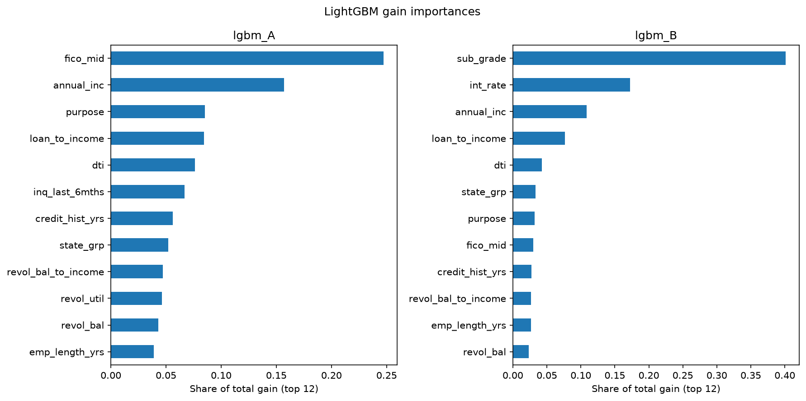
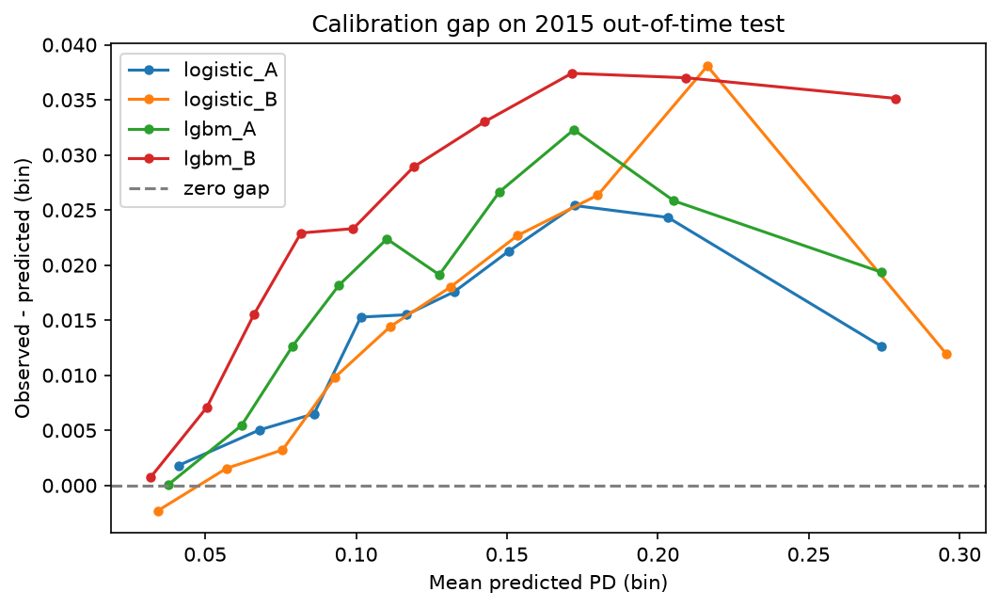
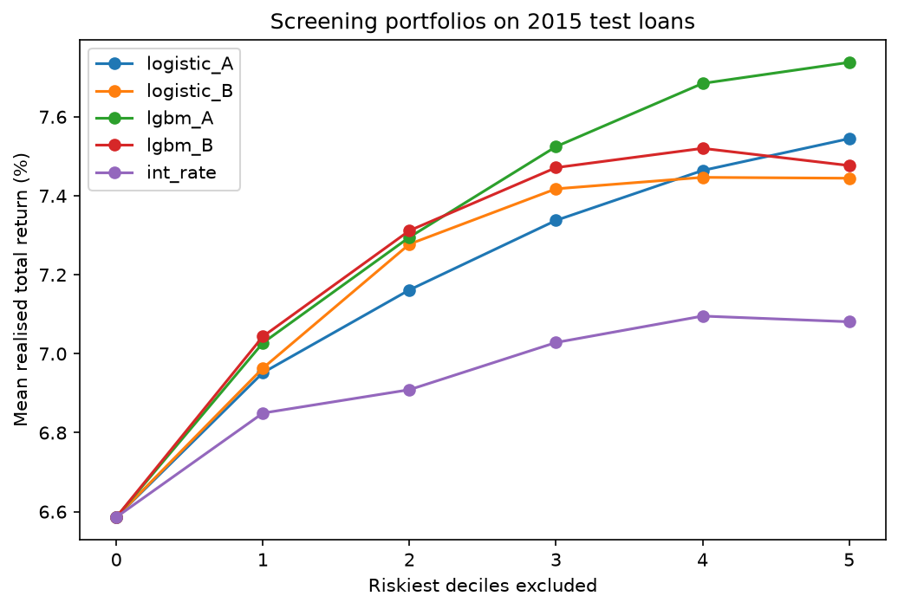

# Predicting loan defaults, and whether the predictions would have made money

Can publicly available origination attributes predict which LendingClub loans default and would acting on those predictions have improved returns? This project builds probability-of-default models on 500,819 matured 36-month loans issued between 2012 Q1 and 2015 Q3, validates them out-of-time on 2015 originations and then evaluates the predictions economically against realised loan cash flows. Data leakage was especially targeted: each of the 153 columns is classified by whether it is known at origination, the banned set is enforced by tests and a deliberate leakage exhibit shows what including those columns does (AUC 1.00). The models reach a modest AUC 0.659–0.689 against the platform's own interest rate at 0.677.

## Results

Out-of-time test set: 194,357 loans issued 2015 Q1–Q3, observed default rate 14.9%.

| Score | ROC AUC | PR AUC | Brier | Mean predicted PD |
|---|---|---|---|---|
| `int_rate` alone (benchmark) | 0.677 | 0.250 | – | – |
| Logistic, borrower attributes (A) | 0.659 | 0.239 | 0.1222 | 0.135 |
| Logistic, attributes + platform pricing (B) | 0.689 | 0.260 | 0.1202 | 0.135 |
| LightGBM, attributes (A) | 0.668 | 0.247 | 0.1217 | 0.131 |
| LightGBM, attributes + pricing (B) | 0.689 | 0.264 | 0.1204 | 0.125 |

## Key Takeaways

**1. Borrower attributes alone underperform the platform's pricing.** The attribute-only logistic reaches 0.659 against 0.677 for LendingClub's interest rate used as a raw score. This is the expected direction: `int_rate` is the output of LendingClub's own underwriting model which consumed these attributes plus application and bureau data not present in this dataset. The comparison measures how much of that pricing signal is recoverable from public origination fields.

**1. Attributes add signal on top of pricing.** Both B models beat the benchmark (0.689 vs 0.677), so the two information sources are not fully redundant.

**3. Non-linearity matters only where the features are raw.** LightGBM lifts the attribute-only model from 0.659 to 0.668 or halving the gap to the benchmark but adds nothing once pricing is included (0.6890 vs 0.6886). Grade and interest rate are already the output of a model and encode the non-linearities a tree would otherwise have to learn.


*Share of total gain, top 12 features. In the attribute-only model FICO midpoint carries 25% of the gain. Adding the platform's own assessment displaces it almost entirely: `sub_grade` takes 40% and `int_rate` 17% while FICO falls to roughly 3% and eighth place.*

**4. Every model under-predicts 2015 defaults.** Mean predicted PD is 12.5–13.5% against 14.9% observed. The gap is a consequence of vintage drift and is not uniform.


*Observed minus predicted default rate, by predicted-PD decile. The gap is hump-shaped: near zero for the safest loans +3–4 points through the 0.10–0.20 range and narrowing in the riskiest decile. Drift damaged the middle of the risk distribution most so a simple intercept recalibration would only partly repair it. Ranking survives the regime change better than levels do.*

## Would the model have made money?
Realised total return is defined per loan as `(total_pymnt - collection_recovery_fee) / loan_amnt - 1`: cash received over principal lent over a loan life of up to 36 months. It is not annualised and not an IRR (cash-flow timing is not available in this data). The 2015 test book returned 6.59% in total on this basis.


*Mean realised return of the portfolio remaining after excluding the k riskiest deciles under each ranking. Differences are tens of basis points on a 6.6% base.*

Screening on model scores beats screening on price at every depth. Excluding the riskiest three deciles lifts realised return from 6.59% to roughly 7.5% against 7.03% for rate-based screening (about 45bp) comfortably outside sampling error at these portfolio sizes.

The ordering also inverts against AUC: lgbm_A (the weaker default predictor) is the stronger economic screen (7.73% vs 7.48% at k=5). A plausible reading is that a price-aware model excludes loans that are risky but well compensated whereas the attribute-only model isolates loans that are risky relative to their price which is closer to what a lender actually would screen on. The difference is small (about 6bp at k=3, 25bp at k=5) and is offered as just a hypothesis. Testing this properly would need multiple vintages or a bootstrap.

Supporting Results:

- **1. The platform's risk premium worked at first but then stopped.** Realised returns by grade peak at B (9.07%) and are statistically flat through F: the A→B rate premium out-earned its extra defaults but every step beyond B was consumed by them. Since the tail also carries higher return variance, the incremental risk was negatively compensated on a risk-adjusted basis. Grades F and G hold only 3,664 and 369 loans and their confidence intervals span most of the chart.

- **2. Model deciles separate returns where grades do not.** Under `lgbm_B` default rates climb from 3.3% to 31.4% across deciles and realised returns peak at 7.86% (decile 5) before falling to 2.47% in the riskiest decile against 4.2% for the equivalent rate-ranked decile.

## Leakage

[`reports/leakage_audit.csv`](reports/leakage_audit.csv) classifies all 153 columns by when their value becomes known (38 are post-origination, 30 are empty in this cohort and the rest are origination-time, administrative, target or metadata) with a one-line rationale for each row. 
The banned set is enforced in ([`config.py`](src/lending_pd/config.py)) and asserted by [`tests/test_no_leakage.py`](tests/test_no_leakage.py) so a given model can't acquire one.

[`notebooks/99_leakage_exhibit.ipynb`](notebooks/99_leakage_exhibit.ipynb) shows we avoided leakage: training on 21 post-origination numeric columns gives AUC 1.00. For a matured loan `total_rec_prncp` is approximately the loan amount if and only if it was repaid while `recoveries` is positive only if it was not repaid. By comparison the models in this repo reach only AUC 0.689.

The same columns are used deliberately in the economics analysis. Post-origination cash flows are excluded as prediction-time inputs and are the material for evaluation-time measurement of what actually happened.

## Method

**Cohort:** 36-month loans issued 2012 Q1–2015 Q3, restricted to terminal statuses (Fully Paid or Charged Off) so that every loan has had its full term to resolve. Later originations are excluded because they had not matured by the data's cut-off (including them would censor defaults).

**Split:** Train on 2012 Q1–2014 Q4, test on 2015 Q1–Q3. Default rates drift from 11.9% to 15.4% across the cohort so a random split would let a model see the test period's regime. An out-of-time split instead asked whether a model fitted on past loans can rank future loans.

**Features:** Model A uses borrower attributes only. Model B adds `sub_grade` and `int_rate` (the platform's own risk assessment). Engineered features include FICO band midpoint, loan-to-income, revolving-balance-to-income, credit history length at origination and explicit missingness indicators. Two highlighted exclusions: the expanded bureau block was not collected before 2013 so its missingness is vintage-correlated and would break the temporal split; `installment` is dropped from Model A because at fixed term it is a deterministic function of loan amount and interest rate which would smuggle the platform's pricing into the attributes-only model.

**Fitting:** All fitted state (winsorisation caps, state grouping, imputation medians, scaler statistics, one-hot categories, LightGBM's tree count via early stopping on a time-ordered 2014 H2 slice) is learnt on the training window only. Test data is scored once per model.

Analysis notebooks: [EDA](notebooks/02_eda.ipynb) · [modelling](notebooks/03_modelling.ipynb) · [economics](notebooks/04_economics.ipynb).

## Limitations

- **Funded loans only:** LendingClub's rejected applications are not in this cohort so nothing here can be read as beating their underwriting, only as re-ranking loans they chose to fund.
- **Returns are not annualised:** Cash-flow timing is unavailable so a loan repaid early and one repaid on schedule can show the same total return.
- **One split give no error bars on the AUC gaps:** The model comparisons rest on a single out-of-time window; a bootstrap or a rolling-origin evaluation would quantify how stable the 3-point spread is.
- **State features are retained for analysis but would face fair-lending scrutiny** in a production setting as would any geography-conditional-on-credit effect.
- **Thin cells in the tail:** Grade G holds 369 loans; conclusions about F and G are reported with their confidence intervals and should not be depended on.
- **Naive standard errors:** Loans within a grade or vintage share exposure so the reported intervals treat observations as more independent than they are.
- **No hyperparameter search:** LightGBM uses a configuration with early stopping. From this the returns to tuning are small relative to the returns to validation.

## Reproducing

```bash
git clone https://github.com/p-es/lending-pd.git
cd lending-pd
python3 -m venv .venv && source .venv/bin/activate
pip install -r requirements.txt
pip install -e .
```

macOS only: LightGBM needs OpenMP, which pip does not install — `brew install libomp`.

Data is not committed. Download `accepted_2007_to_2018Q4.csv.gz` from the [LendingClub dataset on Kaggle](https://www.kaggle.com/datasets/wordsforthewise/lending-club/data) into `data/raw/` then build the cohort:

Then run [`notebooks/01_data.ipynb`](notebooks/01_data.ipynb) which loads the raw file and builds the `cohort` table in `data/processed/lending.duckdb`. Everything after reads from this database.

```bash
python -m lending_pd.train      # fits all models, writes reports/metrics.json
python -m pytest -q             # leakage and cohort invariants
```

The column dictionary used for the leakage audit is LendingClub's own `LCDataDictionary` taken from [this mirror](https://www.kaggle.com/datasets/jonchan2003/lending-club-data-dictionary?select=Lending+Club+Data+Dictionary+Reject.csv).

## Repository

```
data/            raw and processed data (gitignored)
sql/             cohort construction and analysis queries
src/lending_pd/  config, feature engineering, training script
notebooks/       audit, EDA, modelling, economics, leakage exhibit
reports/         leakage audit, metrics.json, figures
tests/           leakage and cohort invariant tests
```